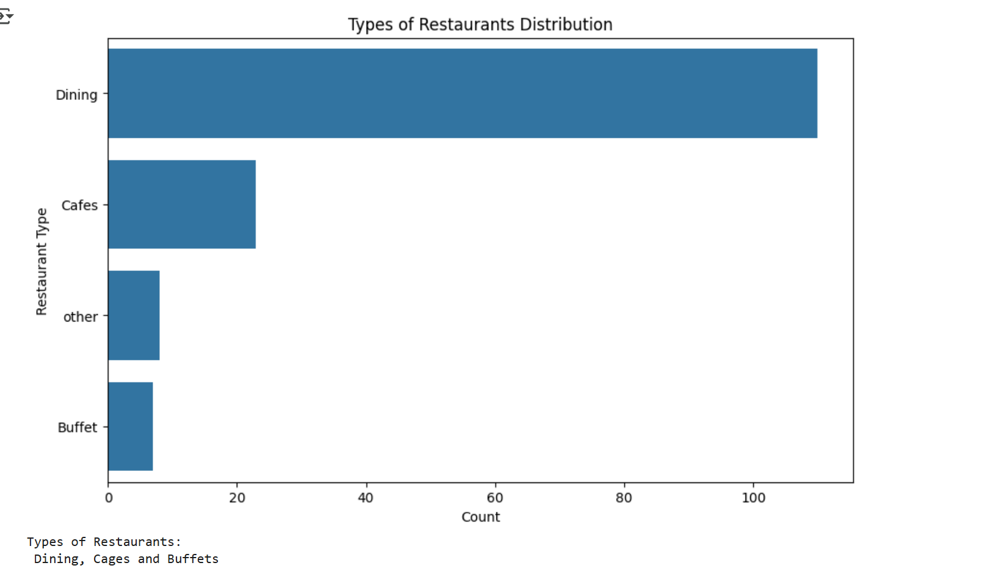
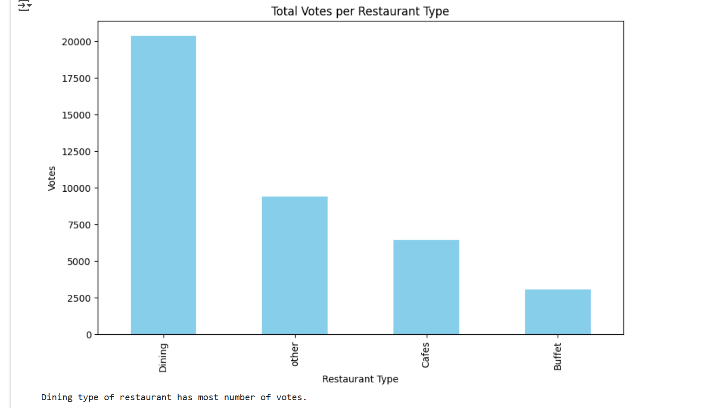
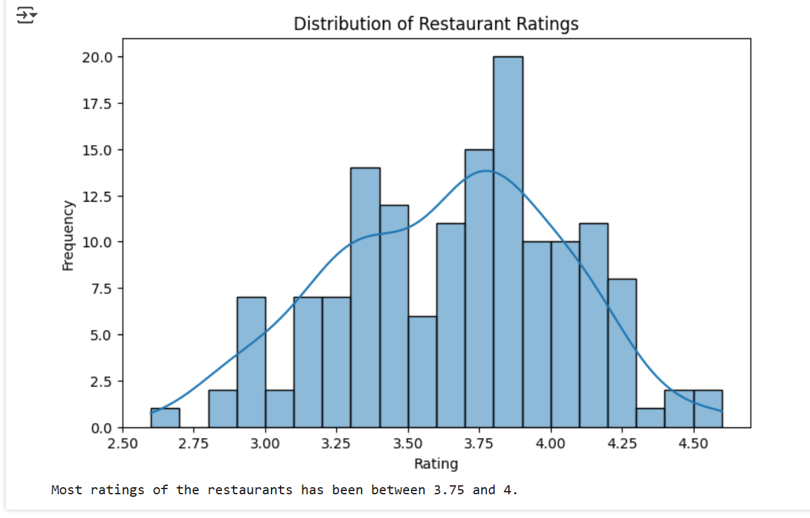
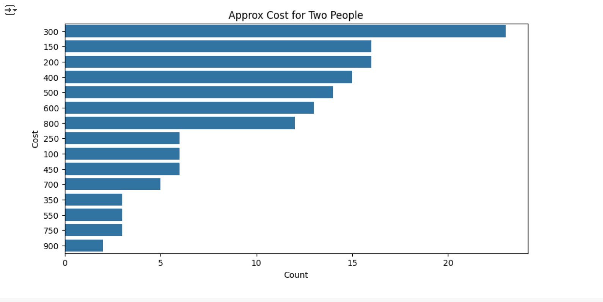
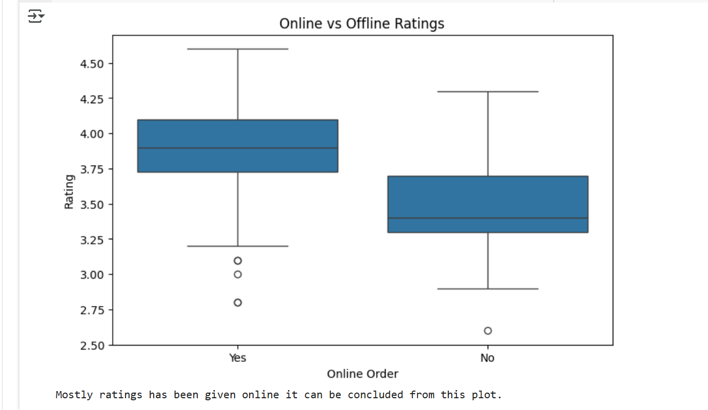
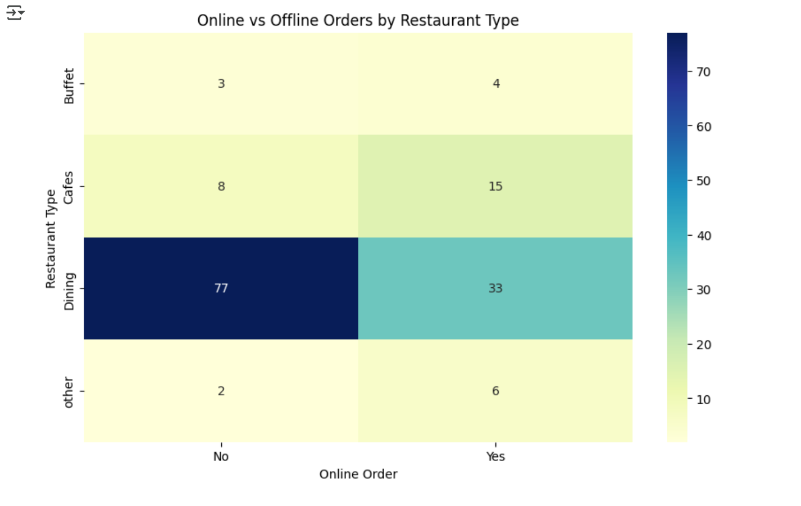

# InlighnTech-Portfolio2
This project involves performing exploratory data analysis (EDA) on Zomato's restaurant dataset to uncover key business insights and customer behavior trends. 

Project Overview
This project involves performing exploratory data analysis (EDA) on Zomato's restaurant dataset to uncover key business insights and customer behavior trends. Using Python and data visualization libraries like Matplotlib and Seaborn, we analyze the types of restaurants, customer ratings, spending habits, and preferences for online vs. offline ordering. The project is built to simulate a real-world data analysis scenario that can guide strategic decisions in the food delivery space.

Project Objectives
1. Understand the types of restaurants most commonly listed on Zomato.
2. Identify which types of restaurants receive the highest number of votes from customers.
3. Analyze the distribution of restaurant ratings.
4. Evaluate average customer spending, especially among couples who order online.
5. Compare online vs. offline ordering in terms of customer ratings.
6. Determine which restaurant types receive more offline orders to plan targeted promotions.

Tools & Technologies Used
Programming Language: Python
Libraries:
Pandas for data manipulation
NumPy for numerical operations
Matplotlib & Seaborn for data visualization
Platform: Jupyter Notebook

Methodology
Step 1: Environment Setup
Ensure Python and Jupyter Notebook are installed. Install required libraries: pandas, numpy, matplotlib, seaborn.
Step 2: Dataset Loading
Load the dataset using Pandas. Display the first few rows to understand the structure of the data.
Step 3: Data Cleaning and Preparation
Convert Rating Format: The rate column contains strings like '4.1/5', which are converted to floats like 4.1. Handle non-numeric entries such as 'NEW' and '-' by replacing them with NaN and dropping rows with null ratings.
Verify and Convert Data Types: Check column data types and convert cost fields to float for numerical analysis. Remove or handle missing values.

Step 4: Exploratory Data Analysis & Visualization
Analysis 1: Types of Restaurants
Use a count plot to visualize the most common restaurant types.

Analysis 2: Votes by Restaurant Type
Group data by restaurant type and sum the votes. Plot a bar chart to visualize popularity.

Analysis 3: Ratings Distribution
Use a histogram to identify the most common rating range (usually 3.5–4.0).

Analysis 4: Cost for Two People
Count plot to observe the most common spending ranges for couples.

 Analysis 5: Online vs Offline Ratings
Box plot comparison of ratings based on whether the restaurant offers online ordering.

 Analysis 6: Online Orders by Restaurant Type
Create a pivot table and visualize it using a heatmap to show online vs offline order preferences by restaurant type.

 Insights Derived
Most customers prefer dining-type restaurants.
Casual dining and cafes receive the highest number of votes.
The majority of restaurant ratings fall between 3.5 and 4.0.
Online-ordering couples typically spend an average of ₹300–₹600.
Online orders tend to receive slightly higher ratings than offline.
Dining restaurants get more offline orders—ideal for offline promotions.

Future Scope
Incorporate customer review text for sentiment analysis.
Predict ratings or customer satisfaction using machine learning.
Track changes in trends over time if time-series data is added.
